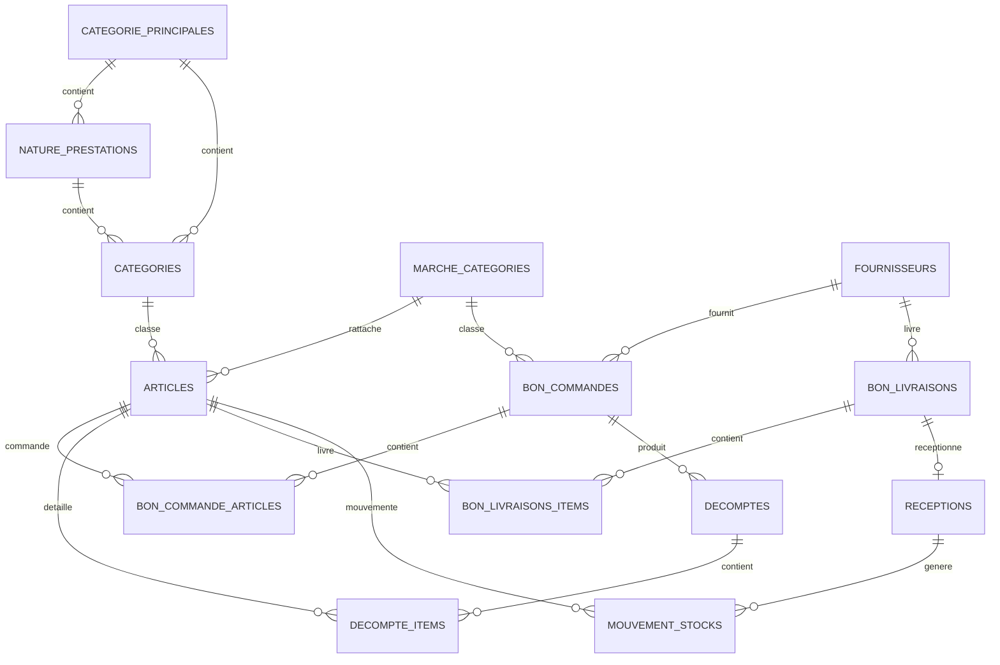

# Documentation technique - Modules Categorie, Article, Marche, Bon de commande et Fournisseur

## 1. Vue generale

Ce document decrit les modules principaux lies aux achats et au stock dans l'application Laravel/Inertia:

- Module Categorie
- Module Article
- Module Marche / Bon de commande
- Module Fournisseur
- Modules associes: Bon de livraison, Reception, Entree stock, Decompte et Mouvement stock

L'application utilise:

- Backend: Laravel 12, PHP 8.2
- Frontend: Inertia.js, Vue 3, Vite, Tailwind CSS
- Permissions: `spatie/laravel-permission`
- Fichiers/media: `spatie/laravel-medialibrary`
- Export PDF: `spatie/laravel-pdf`, `barryvdh/laravel-dompdf`
- Export Excel/import: `maatwebsite/excel`

Important: il n'existe pas de fichier `routes/api.php` dans ce projet. Les "API" utilisees ici sont principalement des routes web Laravel, protegees par `auth` et `verified`, qui retournent des pages Inertia, des modales Inertia ou des fichiers PDF.

## 2. Structure du code

```text
app/
  Http/
    Controllers/
      CategorieController.php
      ArticleController.php
      BonCommandeController.php
      FournisseurController.php
      ReceptionController.php
      DecompteController.php
      ArticleStockController.php
    Resources/
      ShowBonCommandeResource.php
      MarcheValidateResource.php
      ShowFournisseurResource.php
      IndexReceptionResource.php
      ShowReceptionResource.php
  Models/
    CategoriePrincipale.php
    NaturePrestation.php
    Categorie.php
    Article.php
    ArticleImage.php
    MarcheCategory.php
    BonCommande.php
    BonCommandeArticle.php
    Fournisseur.php
    BonLivraison.php
    BonLivraisonItem.php
    Reception.php
    BonReception.php
    LigneReception.php
    EntreeStock.php
    LigneEntreeStock.php
    Decompte.php
    DecompteItem.php
    MouvementStock.php
  Services/
    BordereauArticleImporter.php
database/
  migrations/
  seeders/
resources/
  js/
    Pages/
      Categories/
      Articles/
      Achats/
        BonCommandes/
        Fournisseurs/
      Receptions/
      Stock/
routes/
  web.php
```

## 3. Relation globale entre les modules



## 4. Module Categorie

### Role fonctionnel

Le module Categorie organise les articles par familles/lots. Une categorie appartient a une categorie principale et a une nature de prestation. Elle porte aussi des informations de lot utilisees pour l'affichage et la structuration des marches.

### Tables liees

#### Table `categorie_principales`

| Colonne | Type | Detail |
|---|---|---|
| `id` | bigint | Cle primaire |
| `nom` | string(100) | Nom de la categorie principale |
| `code` | string(20), unique | Code metier |
| `description` | text nullable | Description |
| `est_actif` | boolean | Active/desactive |
| `created_at`, `updated_at` | timestamps | Audit |

#### Table `nature_prestations`

| Colonne | Type | Detail |
|---|---|---|
| `id` | bigint | Cle primaire |
| `nom` | string(100) | Nom de la nature |
| `code` | string(20), unique | Code metier |
| `description` | text nullable | Description |
| `categorie_principale_id` | foreignId | FK vers `categorie_principales.id` |
| `est_actif` | boolean | Active/desactive |
| `created_at`, `updated_at` | timestamps | Audit |

#### Table `categories`

| Colonne | Type | Detail |
|---|---|---|
| `id` | bigint | Cle primaire |
| `nom` | string(100) | Nom de la categorie |
| `code` | string(20) | Code de la categorie |
| `code_lot` | string(20), nullable | Code lot, ex: `LOT-1` |
| `numero_lot` | unsigned tiny integer, nullable | Numero du lot |
| `couleur_affichage` | string(20), nullable | Couleur UI |
| `icone` | string(80), nullable | Nom de l'icone UI |
| `description` | text nullable | Description |
| `categorie_principale_id` | foreignId | FK vers `categorie_principales.id` |
| `nature_prestation_id` | foreignId | FK vers `nature_prestations.id` |
| `est_actif` | boolean | Active/desactive |
| `created_at`, `updated_at` | timestamps | Audit |

Contrainte unique:

```text
unique(code, categorie_principale_id, nature_prestation_id)
```

### Relations Eloquent

`CategoriePrincipale`:

- `categories()`: hasMany `Categorie`
- `articles()`: hasMany `Article`
- `naturePrestations()`: hasMany `NaturePrestation`
- `scopeActives()`: filtre `est_actif = true`

`NaturePrestation`:

- `categoriePrincipale()`: belongsTo `CategoriePrincipale`
- `categories()`: hasMany `Categorie`
- `articles()`: hasMany `Article`
- `scopeActives()`: filtre `est_actif = true`

`Categorie`:

- `categoriePrincipale()`: belongsTo `CategoriePrincipale`
- `naturePrestation()`: belongsTo `NaturePrestation`
- `articles()`: hasMany `Article`
- `scopeActives()`: filtre `est_actif = true`
- `scopeByPrincipale($id)`: filtre par categorie principale

### API/routes du module Categorie

Toutes ces routes sont dans le middleware `auth` + `verified`.

| Methode | URI | Nom route | Controleur | Usage |
|---|---|---|---|---|
| GET | `/categories` | `categories.index` | `CategorieController@index` | Liste les categories avec stats |
| POST | `/categories/import` | `categories.import` | `CategorieController@import` | Importe des articles/categorisations depuis Excel/CSV |
| POST | `/categories/store` | `categories.store` | `CategorieController@store` | Cree une categorie |
| GET | `/categories/{categorie}` | `categories.show` | `CategorieController@show` | Detail d'une categorie |
| GET | `/categories/{categorie}/edit` | `categories.edit` | `CategorieController@edit` | Modale edition |
| PUT | `/categories/{categorie}` | `categories.update` | `CategorieController@update` | Modifie une categorie |

### Validations principales

Creation/modification:

| Champ | Regles |
|---|---|
| `nom` | required, string, max 255 |
| `code` | required, string, max 20, unique |
| `code_lot` | nullable, string, max 20 |
| `numero_lot` | nullable, integer, between 1 and 99 |
| `couleur_affichage` | nullable, string, max 20 |
| `icone` | nullable, string, max 80 |
| `description` | nullable, string, max 500 |
| `est_actif` | boolean |

Import:

| Champ | Regles |
|---|---|
| `fichier` | required, file, mimes xlsx/xls/csv/ods, max 20480 |
| `numero_lot` | nullable, integer, in 1..6 |

### Lots geres par l'import

| Lot | Code categorie | Code lot | Marche |
|---|---|---|---|
| 1 | `VIA` | `LOT-1` | Viandes et Abats |
| 2 | `VOL` | `LOT-2` | Volailles, Lapin et Oeufs |
| 3 | `POI` | `LOT-3` | Poissons et Fruits de Mer |
| 4 | `EP` | `LOT-4` | Epicerie |
| 5 | `LEG` | `LOT-5` | Fruits et Legumes |
| 6 | `PAI` | `LOT-6` | Pain et Viennoiserie |

## 5. Module Article

### Role fonctionnel

Un article represente un produit stockable et commandable. Il appartient a une categorie, a une categorie principale, a une nature de prestation et a une categorie de marche. Les articles sont utilises dans les marches, bons de livraison, receptions, entrees/sorties de stock, inventaires et decomptes.

### Table `articles`

| Colonne | Type | Detail |
|---|---|---|
| `id` | bigint | Cle primaire |
| `reference` | string(50), unique | Reference article |
| `designation` | string | Nom/designation |
| `description` | text nullable | Description |
| `quantite_stock` | decimal(8,2), default 0 | Stock actuel |
| `categorie_id` | foreignId | FK vers `categories.id` |
| `marche_category_id` | foreignId | FK vers `marche_categories.id` |
| `categorie_principale_id` | foreignId | FK vers `categorie_principales.id` |
| `nature_prestation_id` | foreignId | FK vers `nature_prestations.id` |
| `unite_mesure` | string(20), default `UNITE` | Unite |
| `taux_tva` | decimal(5,2), default 0 | TVA article |
| `seuil_minimal` | integer, default 0 | Seuil minimum |
| `seuil_maximal` | integer, default 0 | Seuil maximum |
| `in_marche` | boolean, default false | Visible par defaut via scope global si true |
| `est_actif` | boolean, default true | Article actif |
| `code_lot` | string(20), nullable | Herite de la categorie |
| `numero_lot` | unsigned tiny integer, nullable | Herite de la categorie |
| `couleur_affichage` | string(20), nullable | Herite de la categorie |
| `icone` | string(80), nullable | Herite de la categorie |
| `created_at`, `updated_at` | timestamps | Audit |

### Table `article_images`

| Colonne | Type | Detail |
|---|---|---|
| `id` | bigint | Cle primaire |
| `article_id` | foreignId | FK vers `articles.id`, suppression en cascade |
| `image_path` | string | Chemin image |
| `nom_fichier` | string | Nom original |
| `est_principale` | boolean | Image principale |
| `created_at`, `updated_at` | timestamps | Audit |

### Relations Eloquent

`Article`:

- `categorie()`: belongsTo `Categorie`
- `categoriePrincipale()`: belongsTo `CategoriePrincipale`
- `marcheCategory()`: belongsTo `MarcheCategory`
- `naturePrestation()`: belongsTo `NaturePrestation`
- `images()`: hasMany `ArticleImage`
- `bonCommandeArticles()`: hasMany `BonCommandeArticle`
- `lignesReception()`: hasMany `LigneReception`
- `lignesEntreeStock()`: hasMany `LigneEntreeStock`
- `mouvementsStock()`: hasMany `MouvementStock`
- `mouvementsStockEntree()`: hasMany entrees
- `mouvementsStockSortie()`: hasMany sorties
- `currentBonCommandeArticle()`: prix courant dans un marche actif

`ArticleImage`:

- `article()`: belongsTo `Article`
- accessor `url`: `asset('storage/' . image_path)`

### Regle importante: scope global `IsExistsInMarcheScope`

Le modele `Article` applique automatiquement:

```php
where('in_marche', true)
```

Donc, par defaut, seules les lignes `articles.in_marche = true` sont retournees.

Macros disponibles:

- `Article::withNonExists()`: supprime le scope pour afficher tous les articles
- `Article::onlyNonExists()`: supprime le scope et filtre `in_marche = false`

### Heritages automatiques depuis la categorie

Lors du `saving` d'un article, si `categorie_id` est present, l'article recupere automatiquement:

- `code_lot`
- `numero_lot`
- `couleur_affichage`
- `icone`

depuis la table `categories`.

### API/routes du module Article

| Methode | URI | Nom route | Controleur | Usage |
|---|---|---|---|---|
| GET | `/articles` | `articles.index` | `ArticleController@index` | Liste les articles |
| GET | `/articles/create` | `articles.create` | `ArticleController@create` | Modale creation |
| POST | `/articles` | `articles.store` | `ArticleController@store` | Cree un article |
| GET | `/articles/{article}` | `articles.show` | `ArticleController@show` | Detail article |
| GET | `/articles/{article}/edit` | `articles.edit` | `ArticleController@edit` | Modale edition |
| PUT/PATCH | `/articles/{article}` | `articles.update` | `ArticleController@update` | Modifie un article |
| DELETE | `/articles/{article}` | `articles.destroy` | `ArticleController@destroy` | Route generee, methode non trouvee dans le controleur actuel |
| GET | `/stock/articles` | `articles-stocks.index` | `ArticleStockController@index` | Vue stock articles |
| GET | `/stock/articles/export` | `articles-stocks.export` | `ArticleStockController@export` | Export stock articles |

### Validations principales

Creation:

| Champ | Regles |
|---|---|
| `reference` | required, string, max 50, unique `articles.reference` |
| `designation` | required, string, max 255 |
| `description` | nullable, string, max 255 |
| `categorie_id` | required, exists `categories.id` |
| `marche_category_id` | required, exists `marche_categories.id` |
| `unite_mesure` | required, in `kg`, `L`, `piece`, `sachet`, `sac`, `boite`, `bidon`, `paquet`, `flacon`, `pot`, `bouteille` |
| `est_actif` | boolean |

Modification:

| Champ | Regles |
|---|---|
| `reference` | required, max 50, unique sauf article courant |
| `designation` | required, max 255 |
| `description` | nullable, string, max 255 |
| `categorie_id` | required, exists `categories.id` |
| `marche_category_id` | required, exists `marche_categories.id` |
| `unite_mesure` | required, meme liste que creation |
| `seuil_minimal` | utilise dans l'update |
| `seuil_maximal` | utilise dans l'update |
| `est_actif` | boolean |

## 6. Module Marche / Bon de commande

### Role fonctionnel

Dans le code, la route metier utilise le terme `marches`, mais le modele et la table sont `BonCommande` / `bon_commandes`.

Un marche/bon de commande contient:

- une reference
- un objet
- une periode de validite
- une date de mise en ligne
- une date limite de reception
- une categorie de marche
- des articles commandes
- un fournisseur attribue apres validation
- un statut
- des pieces jointes
- des decomptes

### Table `marche_categories`

| Colonne | Type | Detail |
|---|---|---|
| `id` | bigint | Cle primaire |
| `nom` | string(100) | Nom de categorie marche |
| `est_actif` | boolean | Active/desactive |
| `created_at`, `updated_at` | timestamps | Audit |

Seeders principaux:

- Viandes et Abats
- Volailles, Lapin et Oeufs
- Fruits et Legumes
- Epicerie
- Poissons et Fruits de Mer
- Pain et Viennoiserie
- Quincaillerie et outillage
- Fourniture de plomberie
- Produits d'entretien et detergents
- Fourniture electrique
- Fourniture de bureau

### Table `bon_commandes`

| Colonne | Type | Detail |
|---|---|---|
| `id` | bigint | Cle primaire |
| `reference` | string, unique | Reference marche |
| `objet` | string | Objet du marche |
| `description` | text nullable | Description |
| `date_debut` | date | Debut du marche |
| `date_fin` | date | Fin du marche |
| `date_mise_ligne` | date | Date mise en ligne |
| `date_limite_reception` | date | Limite reception/offre |
| `statut` | string nullable | Statut courant |
| `pieces_jointes` | longText nullable | JSON/array de chemins |
| `notes` | text nullable | Notes |
| `categorie_id` | foreignId | FK vers `marche_categories.id` |
| `categorie_principale_id` | foreignId | FK vers `categorie_principales.id` |
| `nature_prestation_id` | foreignId | FK vers `nature_prestations.id` |
| `fournisseur_id` | foreignId nullable | FK vers `fournisseurs.id` |
| `created_by` | foreignId | FK vers `users.id` |
| `updated_by` | foreignId nullable | FK vers `users.id` |
| `annule_at` | timestamp nullable | Date annulation |
| `reason_annulation` | text nullable | Raison annulation |
| `deleted_at` | soft delete | Suppression logique |
| `created_at`, `updated_at` | timestamps | Audit |

### Table `bon_commande_articles`

| Colonne | Type | Detail |
|---|---|---|
| `id` | bigint | Cle primaire |
| `quantite_commandee` | decimal(8,2) | Quantite commandee |
| `taux_tva` | decimal(8,2), nullable | TVA |
| `prix_unitaire_ht` | decimal(8,2), nullable | Prix HT ajoute lors de validation |
| `montant_ht` | decimal(8,2), nullable | `quantite * prix_unitaire_ht` |
| `montant_tva` | decimal(8,2), nullable | `montant_ht * taux_tva / 100` |
| `montant_ttc` | decimal(8,2), nullable | `montant_ht + montant_tva` |
| `bon_commande_id` | foreignId | FK vers `bon_commandes.id`, cascade delete |
| `article_id` | foreignId | FK vers `articles.id`, cascade delete |
| `created_at`, `updated_at` | timestamps | Audit |

### Table `historique_statut_bcs`

| Colonne | Type | Detail |
|---|---|---|
| `id` | bigint | Cle primaire |
| `ancien_statut` | string | Ancien statut |
| `nouveau_statut` | string | Nouveau statut |
| `raison` | text nullable | Raison du changement |
| `bon_commande_id` | foreignId | FK vers `bon_commandes.id` |
| `changed_by` | foreignId | FK vers `users.id` |
| `created_at`, `updated_at` | timestamps | Audit |

### Statuts du bon de commande

Constantes dans `BonCommande`:

| Constante | Valeur | Sens |
|---|---|---|
| `STATUT_CREE` | `cree` | Marche cree, pas encore attribue |
| `STATUT_ATTENTE_LIVRAISON` | `attente_livraison` | Marche valide, fournisseur attribue, attente livraison |
| `STATUT_LIVRE_COMPLETEMENT` | `livre_completement` | Tout est livre |
| `STATUT_LIVRE_PARTIELLEMENT` | `livre_partiellement` | Livraison partielle |
| `STATUT_ANNULE` | `annule` | Marche annule |

### Relations Eloquent

`MarcheCategory`:

- table `marche_categories`
- scope `active()`: filtre `est_actif = true`

`BonCommande`:

- `categorie()`: belongsTo `MarcheCategory`, via `categorie_id`
- `categoriePrincipale()`: belongsTo `CategoriePrincipale`
- `naturePrestation()`: belongsTo `NaturePrestation`
- `articles()`: hasMany `BonCommandeArticle`
- `fournisseur()`: belongsTo `Fournisseur`
- `bonReceptions()`: hasMany `BonReception`
- `decomptes()`: hasMany `Decompte`, FK `marche_id`
- `createdBy()`: belongsTo `User`
- `historiqueStatuts()`: hasMany `HistoriqueStatutBc`
- `scopeCurrent()`: marche actif entre `date_debut` et `date_fin`
- `scopeEnAttenteDeLivraison()`: filtre `attente_livraison` et `livre_partiellement`
- `scopeAvecArticlesARecevoir()`: filtre les marches avec reste a recevoir

`BonCommandeArticle`:

- `bonCommande()`: belongsTo `BonCommande`
- `article()`: belongsTo `Article` avec `withNonExists()` pour ignorer le scope global `in_marche`

### Calculs metier

Dans `BonCommande`:

- `total_ttc`: somme des `montant_ttc` des lignes
- `total_ht`: somme des `montant_ht`
- `total_tva`: somme des `montant_tva`
- `getQuantiteRecuePourArticle($articleId)`: somme les quantites receptionnees par article
- `getResteRecevoirPourArticle($articleId)`: quantite commandee - quantite recue
- `estCompletementLivree()`: toutes les lignes sont recues
- `estPartiellementLivree()`: au moins une ligne recue et au moins une ligne manquante
- `mettreAJourStatut()`: met a jour selon les receptions

### API/routes du module Marche / Bon de commande

| Methode | URI | Nom route | Controleur | Usage |
|---|---|---|---|---|
| GET | `/achats/marches` | `bon-commandes.index` | `BonCommandeController@index` | Liste des marches |
| GET | `/achats/marches/create` | `bon-commandes.create` | `BonCommandeController@create` | Modale creation |
| POST | `/achats/marches` | `bon-commandes.store` | `BonCommandeController@store` | Cree un marche |
| GET | `/achats/marches/{bonCommande}` | `bon-commandes.show` | `BonCommandeController@show` | Detail marche |
| GET | `/achats/marches/{bonCommande}/edit` | `bon-commandes.edit` | `BonCommandeController@edit` | Modale validation/attribution fournisseur |
| POST | `/achats/marches/{bonCommande}/statut` | `bon-commandes.statut` | `BonCommandeController@updateStatut` | Valide/annule/met a jour statut |
| GET | `/achats/marches/{bonCommande}/modify` | `bon-commandes.modify` | `BonCommandeController@modify` | Modale modification marche cree |
| PUT | `/achats/marches/{bonCommande}/modify` | `bon-commandes.updateModify` | `BonCommandeController@updateModify` | Modifie le marche |
| GET | `/achats/marches/{bonCommande}/pdf` | `bon-commandes.pdf` | `BonCommandeController@generatePdf` | Telecharge PDF du marche |
| GET | `/marches/export` | `bon-commandes.export` | `BonCommandeController@export` | Export PDF liste marches |
| GET | `/marches/{bonCommande}/decompte/create` | `decompte.create` | `DecompteController@create` | Modale creation decompte |
| POST | `/marches/{bonCommande}/decompte` | `decompte.store` | `DecompteController@store` | Cree un decompte |
| GET | `/marches/{decompte}/download` | `decompte.download-pdf` | `DecompteController@download` | Telecharge PDF decompte |

Routes generees par `Route::resource` mais a verifier:

| Methode | URI | Remarque |
|---|---|---|
| PUT/PATCH | `/achats/marches/{bonCommande}` | Route generee vers `BonCommandeController@update`, mais la methode n'existe pas dans le controleur actuel |
| DELETE | `/achats/marches/{bonCommande}` | Route generee vers `BonCommandeController@destroy`, mais la methode n'existe pas dans le controleur actuel |

### Validations creation marche

| Champ | Regles |
|---|---|
| `reference` | required, unique `bon_commandes` |
| `objet` | required, string, max 255 |
| `date_debut` | required, date |
| `date_fin` | required, date, after_or_equal `date_debut` |
| `categorie_id` | required, exists `categories.id` dans le controleur actuel |
| `date_mise_ligne` | required, date |
| `date_limite_reception` | required, date, after_or_equal `date_mise_ligne` |
| `articles` | required, array, min 1 |
| `articles.*.article_id` | required, exists `articles.id` |
| `articles.*.quantite_commandee` | required, numeric, min 0.01 |
| `articles.*.taux_tva` | required, numeric, min 0 |

### Validations attribution fournisseur / prix / statut

Cas annulation:

| Champ | Regles |
|---|---|
| `statut` | required, in `annule` |
| `raison` | required, string, min 20 |

Cas validation:

| Champ | Regles |
|---|---|
| `statut` | required, in `attente_livraison`, `livre_completement`, `livre_partiellement` |
| `fournisseur_id` | required, exists `fournisseurs.id` |
| `articles` | required, array, min 1 |
| `articles.*.id` | required, exists `bon_commande_articles.id` |
| `articles.*.prix_unitaire_ht` | required, numeric, min 0 |

### Flux marche

1. Creation du marche via `/achats/marches`.
2. Les lignes sont creees dans `bon_commande_articles` avec quantite et TVA, mais sans prix.
3. Le statut initial est `cree`.
4. Validation via `/achats/marches/{bonCommande}/statut`.
5. Le fournisseur est attribue.
6. Les prix HT sont saisis pour chaque ligne.
7. Le systeme calcule `montant_ht`, `montant_tva`, `montant_ttc`.
8. Les articles concernes peuvent etre marques `in_marche = true`.
9. Le statut passe a `attente_livraison`.
10. Les receptions/livraisons/decomptes exploitent les lignes du marche.

## 7. Module Fournisseur

### Role fonctionnel

Le fournisseur represente l'entreprise ou l'organisme rattache aux marches, bons de livraison et documents d'achat. Un fournisseur peut avoir plusieurs bons de commande.

### Table `fournisseurs`

| Colonne | Type | Detail |
|---|---|---|
| `id` | bigint | Cle primaire |
| `nom` | string | Nom |
| `raison_sociale` | string nullable | Raison sociale |
| `contact` | string nullable | Personne/contact |
| `telephone` | string nullable | Telephone |
| `email` | string nullable | Email |
| `adresse` | text nullable | Adresse |
| `ville` | string nullable | Ville |
| `ice` | string nullable dans migration, requis en controleur | ICE |
| `tp` | string nullable dans migration, requis en controleur | Taxe professionnelle |
| `rc` | string nullable dans migration, requis en controleur | Registre de commerce |
| `if` | string nullable dans migration, requis en controleur | Identifiant fiscal |
| `cb` | string nullable dans migration, requis en controleur | Compte bancaire |
| `cnss` | string nullable dans migration, requis en controleur | CNSS |
| `est_actif` | tinyInteger/boolean | Active/desactive |
| `notes` | text nullable | Notes |
| `logo` | string nullable | Ancien champ logo |
| `deleted_at` | soft delete | Suppression logique |
| `created_at`, `updated_at` | timestamps | Audit |

Le modele implemente aussi `HasMedia` avec une collection media `logo` en fichier unique.

### Relations Eloquent

`Fournisseur`:

- `bonCommandes()`: hasMany `BonCommande`
- media collection `logo`: logo fournisseur
- `scopeActif()`: filtre `est_actif = true`
- `getLogoUrlAttribute()`: URL du logo si stocke dans le disque public
- `getNomAffichageAttribute()`: `raison_sociale` sinon `nom`
- `getContactCompletAttribute()`: contact + telephone + email
- `getAdresseCompleteAttribute()`: adresse + ville
- `activer()`, `desactiver()`, `estActif()`

### API/routes du module Fournisseur

| Methode | URI | Nom route | Controleur | Usage |
|---|---|---|---|---|
| GET | `/achats/fournisseurs` | `fournisseurs.index` | `FournisseurController@index` | Liste fournisseurs |
| POST | `/achats/fournisseurs` | `fournisseurs.store` | `FournisseurController@store` | Cree fournisseur |
| GET | `/achats/fournisseurs/{fournisseur}` | `fournisseurs.show` | `FournisseurController@show` | Detail fournisseur |
| PUT | `/achats/fournisseurs/{fournisseur}` | `fournisseurs.update` | `FournisseurController@update` | Modifie fournisseur |
| DELETE | `/achats/fournisseurs/{fournisseur}` | `fournisseurs.destroy` | `FournisseurController@destroy` | Supprime fournisseur |
| PATCH | `/achats/fournisseurs/{fournisseur}/toggle-statut` | `fournisseurs.toggle-statut` | `FournisseurController@toggleStatut` | Active/desactive |
| GET | `/fournisseurs/export` | `fournisseurs.export` | `FournisseurController@export` | Export PDF |

### Validations creation fournisseur

| Champ | Regles |
|---|---|
| `nom` | required, string, max 255 |
| `raison_sociale` | nullable, string, max 255 |
| `contact` | nullable, string, max 255 |
| `telephone` | nullable, string, max 20 |
| `email` | nullable, email, max 255 |
| `adresse` | nullable, string, max 500 |
| `ville` | nullable, string, max 100 |
| `ice` | required, string, max 50 |
| `tp` | required, string, max 50 |
| `rc` | required, string, max 50 |
| `if` | required, string, max 50 |
| `cb` | required, string, max 50 |
| `cnss` | required, string, max 50 |
| `notes` | nullable, string |
| `logo` | required, image, mimes jpeg/png/jpg/gif, max 2048 |
| `est_actif` | boolean |

### Validations modification fournisseur

Identiques a la creation, sauf:

- `logo`: nullable, image, mimes jpeg/png/jpg/gif, max 2048

### Regles metier fournisseur

- La suppression est refusee si le fournisseur a des bons de commande associes.
- Le statut peut etre inverse par `toggleStatut`.
- Le detail fournisseur charge les 10 derniers bons de commande.
- Le logo est gere par Spatie Media Library, collection `logo`.

## 8. Module Decompte

### Role fonctionnel

Le decompte est un document financier rattache a un marche. Il calcule les montants a partir des receptions/bon livraisons rattaches au marche jusqu'a une date donnee.

### Table `decomptes`

| Colonne | Type | Detail |
|---|---|---|
| `id` | bigint | Cle primaire |
| `date` | date | Date du decompte |
| `marche_id` | foreignId | FK vers `bon_commandes.id` |
| `final` | boolean | Decompte final ou non |
| `created_at`, `updated_at` | timestamps | Audit |

### Table `decompte_items`

| Colonne | Type | Detail |
|---|---|---|
| `id` | bigint | Cle primaire |
| `decompte_id` | foreignId | FK vers `decomptes.id` |
| `article_id` | foreignId | FK vers `articles.id` |
| `quantite` | decimal(8,2) | Quantite regroupee |
| `prix_unitaire` | decimal(8,2) | Prix unitaire |
| `taux_tva` | decimal(5,2) | TVA |
| `montant_ht` | decimal(8,2) | Montant HT |
| `montant_ttc` | decimal(8,2) | Montant TTC |
| `created_at`, `updated_at` | timestamps | Audit |

### Relations Eloquent

`Decompte`:

- `marche()`: belongsTo `BonCommande`, FK `marche_id`
- `items()`: hasMany `DecompteItem`

`DecompteItem`:

- `decompte()`: belongsTo `Decompte`
- `article()`: belongsTo `Article`

### Flux de creation du decompte

1. L'utilisateur ouvre la modale `/marches/{bonCommande}/decompte/create`.
2. Il saisit `date` et `is_final`.
3. Le controleur refuse un deuxieme decompte avec la meme date pour le meme marche.
4. Le systeme cherche les receptions dont le bon de livraison appartient a un chef de commande rattache au marche.
5. Les lignes de bon livraison sont regroupees par article.
6. Le systeme cree les `decompte_items`.
7. Le PDF peut etre telecharge via `/marches/{decompte}/download`.

### Validations

| Champ | Regles |
|---|---|
| `date` | required, date |
| `is_final` | boolean |

## 9. Modules associes: livraison, reception et stock

Ces modules ne sont pas le coeur de la demande, mais ils expliquent comment les articles d'un marche finissent dans le stock.

### Table `bon_livraisons`

| Colonne | Type | Detail |
|---|---|---|
| `id` | bigint | Cle primaire |
| `numero` | string | Numero BL |
| `statut` | string | Statut |
| `date_livraison` | dateTime nullable | Date livraison |
| `chef_commande_id` | foreignId | FK vers `chef_commandes.id` |
| `notes` | text nullable | Notes |
| `created_by` | foreignId nullable | FK user |
| `responsable_id` | foreignId nullable | FK user responsable |
| `fournisseur_id` | foreignId nullable | FK fournisseur |
| `deleted_at` | soft delete | Suppression logique |
| `created_at`, `updated_at` | timestamps | Audit |

### Table `bon_livraisons_items`

| Colonne | Type | Detail |
|---|---|---|
| `id` | bigint | Cle primaire |
| `quantite` | decimal(10,2) | Quantite livree |
| `prix_unitaire` | decimal(10,2) | Prix unitaire |
| `taux_tva` | decimal(5,2), nullable | TVA |
| `bon_livraison_id` | foreignId | FK vers `bon_livraisons.id` |
| `article_id` | foreignId | FK vers `articles.id` |
| `created_at`, `updated_at` | timestamps | Audit |

### Table `receptions`

| Colonne | Type | Detail |
|---|---|---|
| `id` | bigint | Cle primaire |
| `numero` | string | Numero reception |
| `bon_livraison_id` | foreignId | FK vers `bon_livraisons.id` |
| `deleted_at` | soft delete | Suppression logique |
| `created_at`, `updated_at` | timestamps | Audit |

### Routes reception actives

| Methode | URI | Nom route | Controleur | Usage |
|---|---|---|---|---|
| GET | `/bon-receptions` | `bon-receptions.index` | `ReceptionController@index` | Liste receptions |
| GET | `/bon-receptions/create` | `bon-receptions.create` | `ReceptionController@create` | Modale creation |
| POST | `/bon-receptions` | `bon-receptions.store` | `ReceptionController@store` | Cree reception |
| GET | `/bon-receptions/{reception}` | `bon-receptions.show` | `ReceptionController@show` | Detail reception |
| DELETE | `/bon-receptions/{reception}` | `bon-receptions.destroy` | `ReceptionController@destroy` | Supprime reception et ajuste stock |
| GET | `/bon-receptions/{reception}/pdf` | `bon-receptions.pdf` | `ReceptionController@export` | Export PDF |

### Flux reception actuel

1. L'utilisateur cree une reception depuis un bon de livraison livre.
2. Le fichier du bon est sauvegarde dans la collection media `bon`.
3. Pour chaque ligne du bon de livraison:
   - le stock article est incremente
   - un mouvement de stock de type `entree` est cree
4. En suppression de reception:
   - le stock article est decremente
   - les mouvements lies sont supprimes
   - le fichier media est supprime

### Tables legacy ou paralleles

Le projet contient aussi un modele `BonReception` avec les tables:

- `bon_receptions`
- `ligne_receptions`
- `entree_stocks`
- `ligne_entree_stocks`

Ces tables modelisent un autre flux reception/entree stock:

- `bon_receptions` rattache une reception a un `bon_commande_id` et un `fournisseur_id`
- `ligne_receptions` detaille les quantites receptionnees par article
- `entree_stocks` peut etre cree automatiquement depuis un bon de reception
- `ligne_entree_stocks` detaille les lignes d'entree stock

Les routes actives dans `routes/web.php` utilisent actuellement `ReceptionController` et le modele `Reception`, pas `BonReceptionController`.

## 10. Permissions par module

Les controles sont appliques via middleware `permission:*`.

### Categorie

- `list_categories`
- `create_categories`
- `edit_categories`

### Article

- `list_articles`
- `show_articles`
- `create_articles`
- `edit_articles`

### Marche / Bon de commande

- `list_marches`
- `show_marches`
- `create_marches`
- `validate_marches`
- `edit_marches`
- `pdf_marches`
- `export_marches`

### Fournisseur

- `list_fournisseurs`
- `show_fournisseurs`
- `create_fournisseurs`
- `edit_fournisseurs`
- `delete_fournisseurs`
- `export_fournisseurs`

### Reception

- `list_bonReceptions`
- `show_bonReceptions`
- `create_bonReceptions`
- `destroy_bonReceptions`
- `pdf_bonReceptions`

## 11. Donnees envoyees aux pages Inertia

### Categories/Index

Props principales:

- `categories`
- `stats`
- `lotOptions`
- `marcheOptions`
- `filters`
- `importReport`

Stats globales:

- nombre categories actives
- nombre articles
- nombre articles en rupture
- nombre articles sous seuil
- nombre articles actifs

### Categories/Show

Props principales:

- `categorie`
- `stats`
- `articles`
- `recentMouvements`
- `recentBonCommandes`
- `recentBonLivraisons`
- `recentBonReceptions`

### Articles/Index

Props principales:

- `articles`
- `categories`
- `filters`
- `stats`

Filtres:

- `search`
- `categorie_id`
- `status`
- `stock`

### Achats/BonCommandes/Index

Props principales:

- `marches`
- `categories`
- `filters`
- `stats`

Filtres:

- `statut`
- `categorie_id`
- `date_limite`
- `reference`

Stats:

- total
- livre completement
- attente livraison
- montant total

### Achats/Fournisseurs/Index

Props principales:

- `fournisseurs`
- `stats`
- `filters`

Stats:

- total fournisseurs
- actifs
- inactifs
- nombre bons de commande

## 12. Flux complet recommande

### Creation d'un marche avec articles et fournisseur

```text
Categorie principale
  -> Nature prestation
    -> Categorie
      -> Article
        -> BonCommandeArticle
          -> BonCommande / Marche
            -> Fournisseur
              -> BonLivraison
                -> Reception
                  -> MouvementStock
                    -> Decompte
```

Etapes:

1. Creer ou importer les categories/lots.
2. Creer/importer les articles rattaches aux categories et categories de marche.
3. Creer un marche via `/achats/marches`.
4. Ajouter les articles commandes avec quantites et TVA.
5. Valider le marche en choisissant un fournisseur.
6. Saisir les prix unitaires HT.
7. Le systeme calcule les montants HT/TVA/TTC.
8. Generer le PDF marche si statut different de `cree` et `annule`.
9. Receptionner les livraisons via le module reception.
10. Le stock est mis a jour par les mouvements.
11. Generer les decomptes du marche.

## 13. Points d'attention dans le code actuel

Ces points ne sont pas des corrections appliquees ici, mais des observations utiles pour maintenance.

### 13.1 Incoherence `categorie_id` dans BonCommandeController

La migration `bon_commandes.categorie_id` declare une FK vers `marche_categories.id`.

Mais `BonCommandeController@store` et `updateModify` valident:

```text
categorie_id => required|exists:categories,id
```

Alors que les pages chargent les categories avec:

```php
MarcheCategory::active()->get(['id', 'nom'])
```

La validation devrait probablement cibler `marche_categories,id`.

### 13.2 Routes resource generees sans methodes controleur

`Route::resource('marches', BonCommandeController::class)` genere `update` et `destroy`, mais le controleur actuel expose plutot:

- `modify`
- `updateModify`
- `updateStatut`

Les routes suivantes risquent donc de produire une erreur si appelees:

- `PUT/PATCH /achats/marches/{bonCommande}`
- `DELETE /achats/marches/{bonCommande}`

### 13.3 Condition logique suspecte dans `updateModify`

Le code contient:

```php
if (!$bonCommande->statut == 'cree') {
```

En PHP, cette expression peut ne pas faire ce qui est attendu. L'intention semble etre:

```php
if ($bonCommande->statut !== 'cree') {
```

### 13.4 Condition logique suspecte dans annulation `updateStatut`

Le code contient:

```php
if (!$bonCommande->statut == 'cree' || !$bonCommande->statut == 'attente_livraison') {
```

L'intention semble probablement etre:

```php
if (!in_array($bonCommande->statut, ['cree', 'attente_livraison'])) {
```

### 13.5 Historique de statut partiellement commente

Dans `BonCommandeController@store` et `updateStatut`, la creation de `HistoriqueStatutBc` est commentee. L'historique est actif dans la methode `annuler`, mais cette methode n'est pas exposee directement par une route dediee dans `routes/web.php`.

### 13.6 Export liste bon commandes: typo possible

Dans `ListBonCommandesExport`, le champ:

```php
'objet' => $this->objct
```

semble etre une typo. La colonne du modele est `objet`.

### 13.7 Deux implementations reception

Le projet contient:

- flux actif: `ReceptionController`, table `receptions`, relation avec `bon_livraisons`
- flux ancien/parallele: `BonReception`, `bon_receptions`, `ligne_receptions`, `entree_stocks`

Il faut choisir clairement un flux principal pour eviter des incoherences entre stock, livraison, reception et marche.

## 14. Resume des relations principales

| Module | Relation principale | Sens |
|---|---|---|
| Categorie principale | 1 -> N Nature prestations | Une famille contient plusieurs natures |
| Categorie principale | 1 -> N Categories | Une famille contient plusieurs categories |
| Nature prestation | 1 -> N Categories | Une nature classe plusieurs categories |
| Categorie | 1 -> N Articles | Une categorie contient plusieurs articles |
| Marche category | 1 -> N Articles | Une categorie marche regroupe des articles |
| Marche category | 1 -> N Bons commandes | Une categorie marche classe des marches |
| Fournisseur | 1 -> N Bons commandes | Un fournisseur peut gagner plusieurs marches |
| Bon commande | 1 -> N Lignes commande | Un marche contient plusieurs articles commandes |
| Article | 1 -> N Lignes commande | Un article peut etre commande plusieurs fois |
| Bon commande | 1 -> N Decomptes | Un marche peut avoir plusieurs decomptes |
| Decompte | 1 -> N Decompte items | Un decompte detaille les articles |
| Bon livraison | 1 -> 1 Reception | Un BL livre peut etre receptionne |
| Reception | 1 -> N Mouvements stock | Une reception genere des mouvements |
| Article | 1 -> N Mouvements stock | Le stock d'un article evolue par mouvements |

## 15. Fichiers importants a maintenir

| Besoin | Fichiers |
|---|---|
| Ajouter/changer routes | `routes/web.php` |
| Modifier categorie | `app/Models/Categorie.php`, `app/Http/Controllers/CategorieController.php`, pages `resources/js/Pages/Categories` |
| Modifier article | `app/Models/Article.php`, `app/Http/Controllers/ArticleController.php`, pages `resources/js/Pages/Articles` |
| Modifier marche | `app/Models/BonCommande.php`, `app/Models/BonCommandeArticle.php`, `app/Http/Controllers/BonCommandeController.php`, pages `resources/js/Pages/Achats/BonCommandes` |
| Modifier fournisseur | `app/Models/Fournisseur.php`, `app/Http/Controllers/FournisseurController.php`, pages `resources/js/Pages/Achats/Fournisseurs` |
| Modifier reception active | `app/Models/Reception.php`, `app/Http/Controllers/ReceptionController.php`, pages `resources/js/Pages/Receptions` |
| Modifier decompte | `app/Models/Decompte.php`, `app/Models/DecompteItem.php`, `app/Http/Controllers/DecompteController.php` |
| Modifier schema DB | `database/migrations` |
| Modifier donnees initiales | `database/seeders` |

